# Bday Reminder App

Project idea:\
Have you ever forgotten someone's birthday? It happened to me, therefore I decided to write an application to save birthdays.
Now I have all the dates in one place :).

## Table of contents

- [Overview](#overview)
  - [How to start](#how-to-start)
  - [Database design](#database-design)
  - [Screenshot](#screenshot)
- [My process](#my-process)
  - [Built with](#built-with)
  - [Useful resources](#useful-resources)

## Overview

Project description:\
An application requires authentication (email and password).
A home page (available after successfull authentication) informs about today's Name Days and how many people celebrate their birthday today.
Bday Reminder App allows to easily manage entries (birthdays) - all entries are displayed on profile page and sorted by month. On the same page can easily add, edit or delete existing birthdays.\
Entries celebrating a birthday on the current day are highlighted in a yellow color.\
At the end of the profile page is a bar chart showing the number of birthdays in a given month.\

Technical information:\
It's a Single Page Application using the Express/Node backend and React frontend.\

An Axios HTTP client integrates a public API - in my case Name Day API. The app interact with the chosen API and fetch today's namedays.
Moreover an Axios client integrates a private API (authentication and birthdays management).\

User data are persist using a PostgreSQL database.
An application used CRUD methods to manipulate data in the database and data validation applied on frontend and backend.
Error handling - console log (for developers) and user-relevant errors displaying on the pages.

### How to start

Steps to run the project locally:

- use e.g. Visual Studio Code https://code.visualstudio.com/docs/setup/windows,
- install Node.js https://nodejs.org/en
- clone the repository to the selected folder,
- open the bday-reminder App solution in Visual Studio Code or related,
- create file named .env and fill it like .env.example file (or see below):
  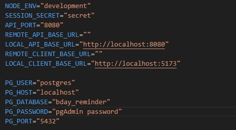
- to install required dependencies run command -> npm install,
- download the PostgreSQL Installer https://www.postgresql.org/download/windows/ and create a new pgAdmin account,
- create a new database called e.g. "bday_reminder" in pgAdmin,
- run the queries.sql code in pgAdmin Query Tool to create required tables,
- run the project -> npm start,
- App is running on localhost, so open a web browser and run http://localhost:5173/

### Database schema

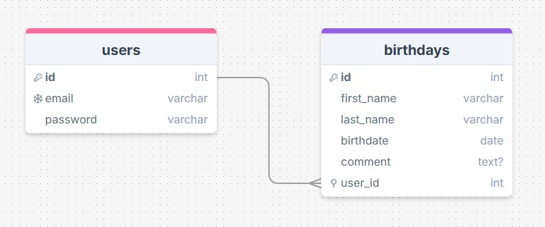

### Screenshot

- Sign in / Sign up page

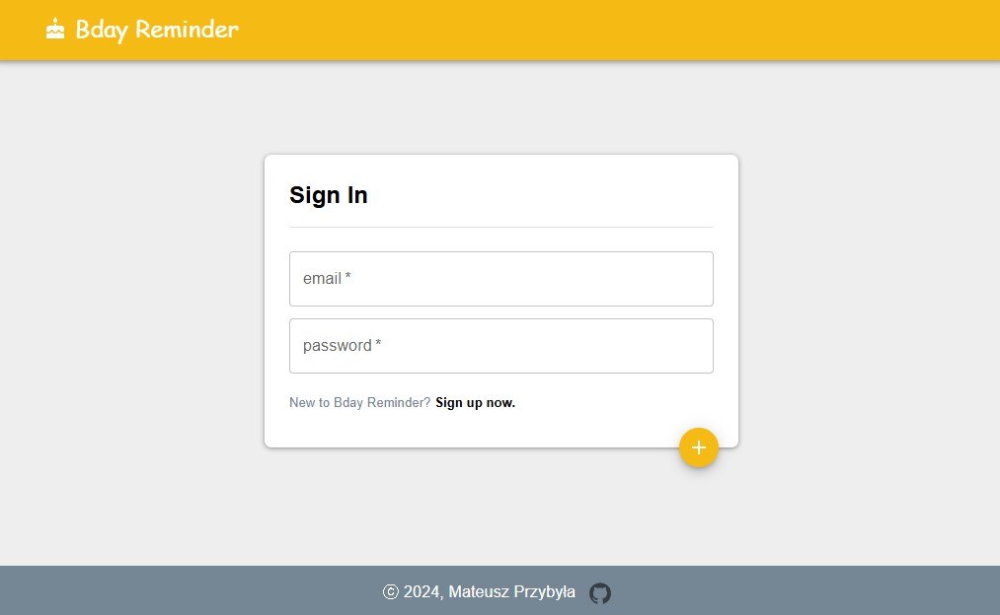

- Frontend textfields validation

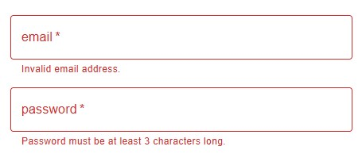

- Home page with greeting, date, time, today's namedays and information about today's birthdays

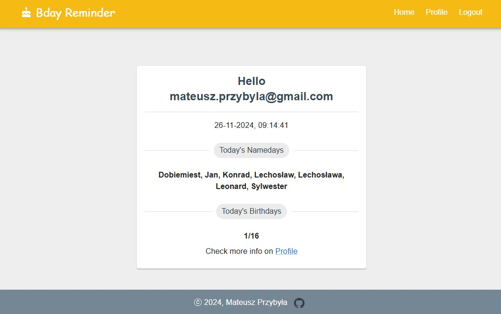

- Profile page with birthday cards

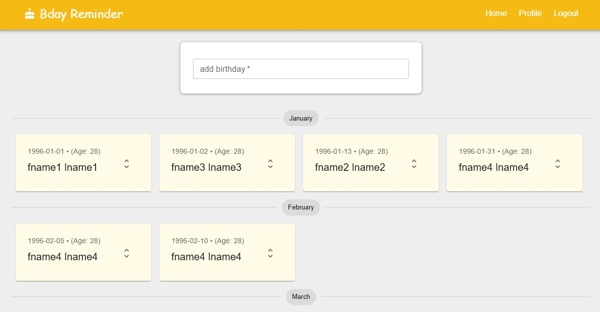

- Highlighted today's birthday

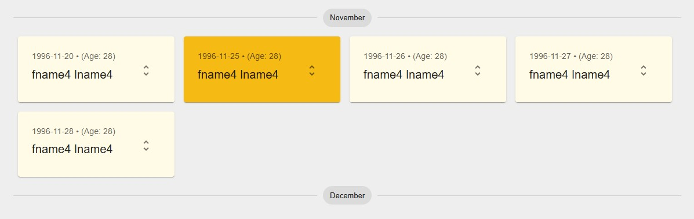

- Birthday card actions

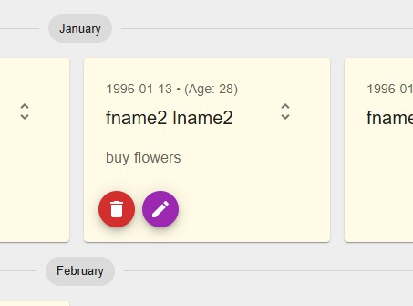

- Edit birthday data modal

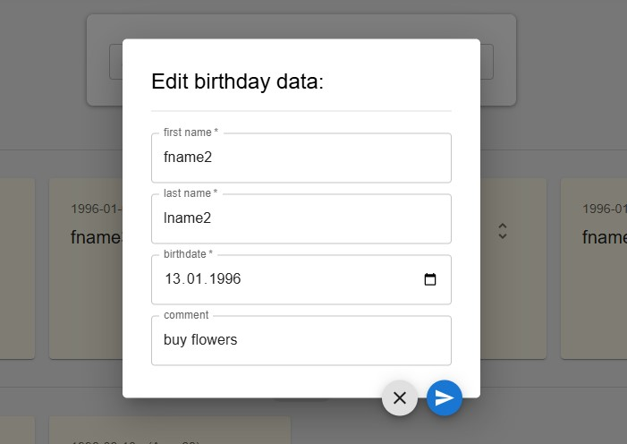

- Collapsed add birthday form

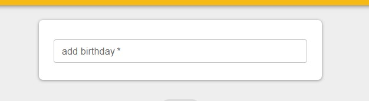

- Expanded add birthday form

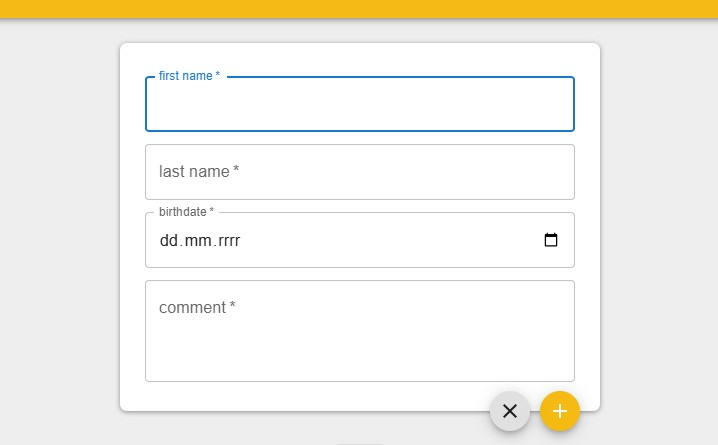

- Birthdays bar chart

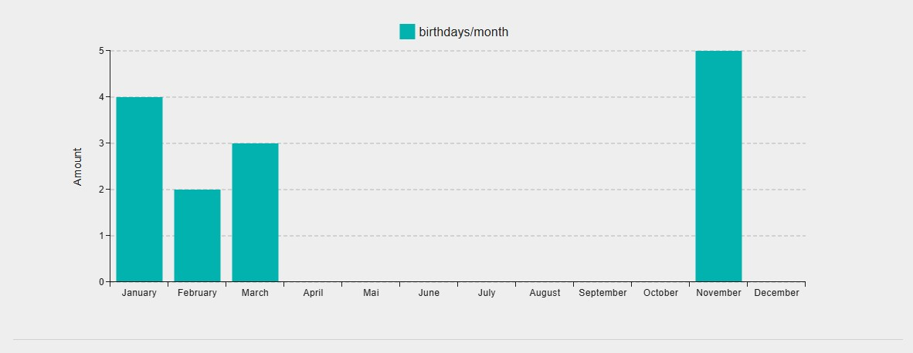

- Mobile menu

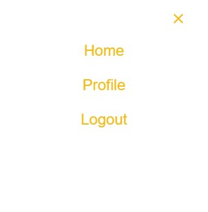

- Mobile profile page

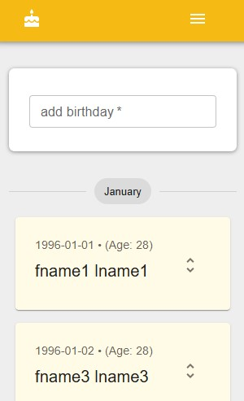

## My process

### Built with

Backend - API:

- Node.js project using Express.js,
- 'pg' package for working with localhost PostgreSQL database,
- 'express-validator' package to validate data send from the frontend through API calls,
- 'cors' package to get more control over which websites access your server's recources.
- Passport Strategy for authenticating with username and password,
- included appropriate response codes for the HTTP requests,

Frontend:

- JavaScript, React.js,
- Material UI,
- Vite.js,
- HTML, CSS,
- MUI X Components: bar chart,
- Custom components,
- React Router,
- React Hooks: useEffect, useState, custom hooks,
- Axios for making HTTP requests to the API and handle responses,
- Mobile First Approach,

### Useful resources

- [Web Development Bootcamp](https://www.udemy.com/course/the-complete-web-development-bootcamp/?couponCode=KEEPLEARNING)
- [Express.js documentation](https://expressjs.com/)
- [Node.js documentation](https://nodejs.org/docs/latest/api/)
- [Axios documentation](https://axios-http.com/docs/intro)
- [Postgres documentation](https://www.postgresql.org/)
- [Założenia REST API](https://devszczepaniak.pl/wprowadzenie-do-rest-api/)
- [React.js documentation](https://legacy.reactjs.org/)
- [How to code in React.js](https://www.digitalocean.com/community/tutorial-series/how-to-code-in-react-js)
- [Destructuring assignment](https://developer.mozilla.org/en-US/docs/Web/JavaScript/Reference/Operators/Destructuring_assignment)
- [Single Page Application](https://kissdigital.com/pl/blog/single-page-application-jak-dziala-spa-i-czym-sie-rozni-od-mpa)
- [How to Configure Proxy in Vite?](https://www.geeksforgeeks.org/how-to-configure-proxy-in-vite/)
- [How to Configure CORS in Node.js With Express](https://dev.to/speaklouder/how-to-configure-cors-in-nodejs-with-express-11h)
- [Passport strategy for authenticating with a username and password.](https://www.passportjs.org/packages/passport-local/)
- [Name Day API.](https://nameday.abalin.net/docs/)
